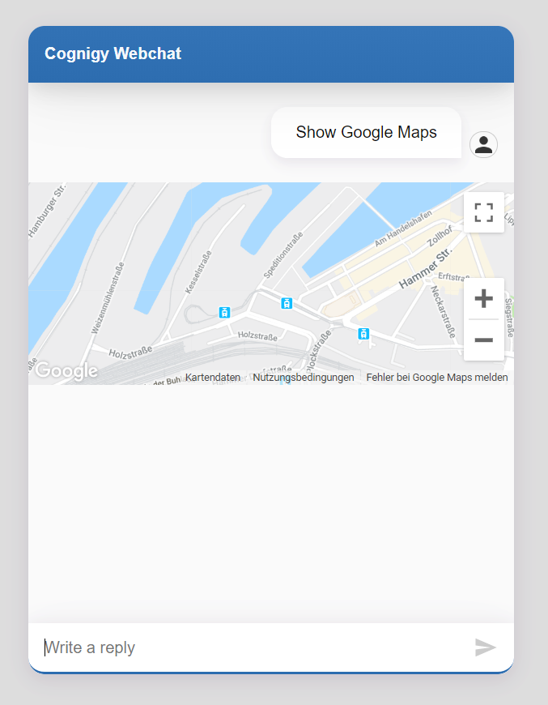

# Google Maps
Integrated Cognigy.AI with Google Maps (https://developers.google.com/maps/documentation/)

This module is based on node-request-promise (https://www.npmjs.com/package/request-promise)

### Secret
This modules needs a CognigySecret to be defined and passed to the Nodes. The secret must have the following keys:

- **key**:  api_key, key
- **value**: Your Google Maps API KEY

## Node: Show Google Maps

**Properties**

There are two ways to use this Custom Module. Use the [Google Maps Geocoding API](https://developers.google.com/maps/documentation/geocoding/start) to get the longitude and latitude of the address. 

*IMPORTANT: You need to enable the **Geocoding API** and the **Maps JavaScript API**, while the first one is used to get the latitude and longitude from the search query and the second one to show it with the webchat plugin.*

If the Searchquery field is empty or no Place was found, the module use the default values from Latitude and Longitude. 

**View**

In combination with the google-maps Webchat Plugin you get this view:


## Node: Get User Location From Text Message

In order to get the user location, one can ask for the it via plain text. The minimum information required from the user to execute this node is: `place`, `city`, and `country`. 

This node returns the closest location google maps can provide based on the given data (`place`):

```json 
{
  "place": {
    "coordinates": {
      "latitude": 51.2139586,
      "longitude": 6.7489951
    },
    "address": "Speditionstraße 1, 40221 Düsseldorf, Germany",
    "name": "Cognigy"
  }
}
```