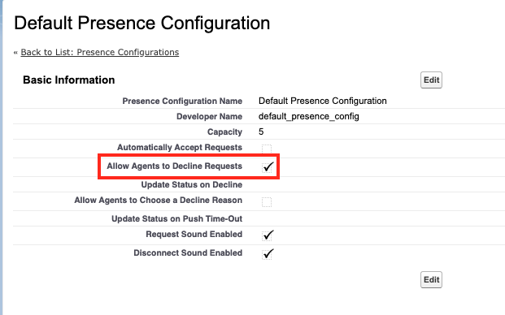

Integrates Cognigy.AI with Salesforce (https://www.salesforce.com)

**Connection (Live Chat)**

If one wants to use the **Start Live Chat** Node, another connection is required. The following keys need to be included:

- organizationId
  - Your Salesforce Organization ID
  - [How to find](https://help.salesforce.com/articleView?id=000325251&type=1&mode=1)
- deploymentId
  - The ID of your Salesforce Deployment
- livechatButtonId
  - The ID of your live chat button
- liveAgentUrl
  - The URL of your live agent
  - e.g. https://d.foo-bar-ord.salesforceliveagent.com/

Please have a look at this tutorial in order to get all required values: [Get Chat Settings from Your Org](https://developer.salesforce.com/docs/atlas.en-us.noversion.service_sdk_ios.meta/service_sdk_ios/live_agent_cloud_setup_get_settings.htm)


The following Nodes provide various methods for the [Salesforce Service Cloud](https://www.salesforce.com/de/campaign/sem/service-cloud/).

## Node: Start Live Chat

This Node creates a new Salesforce Live Chat session and chat request. If it returned that `startedLiveChat` equals `true`, the live agent should received a chat request in the Salesforce Service Console:

```json
"liveChat": {
    "session": {
      "key": "ee809075-...KQt3Z98S+M=",
      "id": "ee809075-...377eaa4d11f0",
      "clientPollTimeout": 40,
      "affinityToken": "84aa1ta1"
    },
    "startedLiveChat": true
  }
```

Inside the **Salesforce Service Console**:


### Configure Prechat Information

One has the opportunity to send some information to the Salesforce live agent so that their knows what to talk about. In order to do so, two different types of information can be sent:

1. Visitor Name
2. Prechat Details
3. Prechat Entities

**Visitor Name:**

Since the live agent should know who their are talking to, one can defind the visitor's name. From default, it uses the `{{input.text}}` Cognigy Script to get the user Id for the current channel.

**Prechat Details:**

- [Please read the documentation](https://developer.salesforce.com/docs/atlas.en-us.live_agent_rest.meta/live_agent_rest/live_agent_rest_data_types.htm#CustomDetail)

This could contain any kind of information that was collected during the bot conversation, such as context variables:

```json
[
	{
		"label": "Cognigy",
		"value": "Infos from chat: {{context.key}}",
		"transcriptFields": [
			"Body"
		],
		"displayToAgent": true
	}
]
```

or

```json
[
       {
         "label":"LastName",
         "value":"Mustermann",
         "entityMaps":[
            {
               "entityName":"contact",
               "fieldName":"LastName"
            }
         ],
         "transcriptFields":[
            "LastName__c"
         ],
         "displayToAgent":true
      },
      {
         "label":"FirstName",
         "value":"Max",
         "entityMaps":[
            {
               "entityName":"contact",
               "fieldName":"FirstName"
            }
         ],
         "transcriptFields":[
            "FirstName__c"
         ],
         "displayToAgent":true
      },
      {
         "label":"Email",
         "value":"max.mustermann@mail.de",
         "entityMaps":[
            {
               "entityName":"contact",
               "fieldName":"Email"
            }
         ],
         "transcriptFields":[
            "Email__c"
         ],
         "displayToAgent":true
      },
      {
         "label":"Status",
         "value":"New",
         "entityMaps":[
            {
               "entityName":"Case",
               "fieldName":"Status"
            }
         ],
         "transcriptFields":[
            "caseStatus__c"
         ],
         "displayToAgent":true
      },
      {
         "label":"Origin",
         "value":"Web",
         "entityMaps":[
            {
               "entityName":"Case",
               "fieldName":"Origin"
            }
         ],
         "transcriptFields":[
            "caseOrigin__c"
         ],
         "displayToAgent":true
      },

      {
         "label":"Subject",
         "value":"TestCaseSubject",
         "entityMaps":[
            {
               "entityName":"Case",
               "fieldName":"Subject"
            }
         ],
         "transcriptFields":[
            "subject__c"
         ],
         "displayToAgent":true
      },
      {
         "label":"Description",
         "value":"TestCaseDescriptionShr",
         "entityMaps":[
            {
               "entityName":"Case",
               "fieldName":"Description"
            }
         ],
         "transcriptFields":[
            "description__c"
         ],
         "displayToAgent":true
      }
   ]
```

The above JSON information is displayed as **Details** in the Salesforce Service Console.

**Prechat Entities:**

- [Please red the documentation](https://developer.salesforce.com/docs/atlas.en-us.live_agent_rest.meta/live_agent_rest/live_agent_rest_data_types.htm#Entity)

If one wants to connect the bot user with a Salesforce Entity (e.g. Contact), so-called Prechat Entites could be sent to the live chat session:

```json
[
   {
         "entityName":"Contact",         
         "saveToTranscript": "Contact",
         "linkToEntityName":"Case",
         "linkToEntityField":"ContactId",
         "showOnCreate":true,          
         "entityFieldsMaps":[
             {
               "fieldName":"LastName",
               "label":"LastName",
               "doFind":true,
               "isExactMatch":true,
               "doCreate":true
            },
            {
               "fieldName":"FirstName",
               "label":"FirstName",
               "doFind":true,
               "isExactMatch":true,
               "doCreate":true
            },
            {
               "fieldName":"Email",
               "label":"Email",
               "doFind":true,
               "isExactMatch":true,
               "doCreate":true
            }          
         ]
      },
       {
         "entityName":"Case",
         "showOnCreate":true,          
         "saveToTranscript":"Case",
         "entityFieldsMaps":[
            {
               "fieldName":"Status",
               "label":"Status",
               "doFind":false,
               "isExactMatch":false,
               "doCreate":true
            },
            {
               "fieldName":"Origin",
               "label":"Origin",
               "doFind":false,
               "isExactMatch":false,
               "doCreate":true
            },  

         {
               "fieldName":"Subject",
               "label":"Subject",
               "doFind":false,
               "isExactMatch":false,
               "doCreate":true
            },
            {
               "fieldName":"Description",
               "label":"Description",
               "doFind":false,
               "isExactMatch":false,
               "doCreate":true
            }         
         ]             
        
      }      
      
   ]
```

## Node: Check Live Agent Availability

Checks whether there is a free agent for the provided live chat button. It returns the following format:

```json
"available": {
    "messages": [
      {
        "type": "Availability",
        "message": {
          "results": [
            {
              "id": "5733f000000sdfgd",
              "isAvailable": true
            }
          ]
        }
      }
    ]
  }
```

In order to get the information, one has to turn on that an agent can **decline a chat request** in Salesforce:




## Node: Stop Live Chat

As soon as the user is finished with the agent conversation, this Node can be used to stop the curent live agent session. One needs the `liveAgentAffinity` and `liveAgentSessionKey` which were stored into the context before. After executing this Node, the Salesforce Live Agent chat will end and the Node will return `true`.

## Node: Send Message To Live Agent

In order to send a message to the current live agent session, this Node is required. One needs the `liveAgentAffinity` and `liveAgentSessionKey` which were stored into the context before -- by **Start Live Chat**. Furthermore, a `text` message must be defined. After sending a message, this node doesn't return anything.
